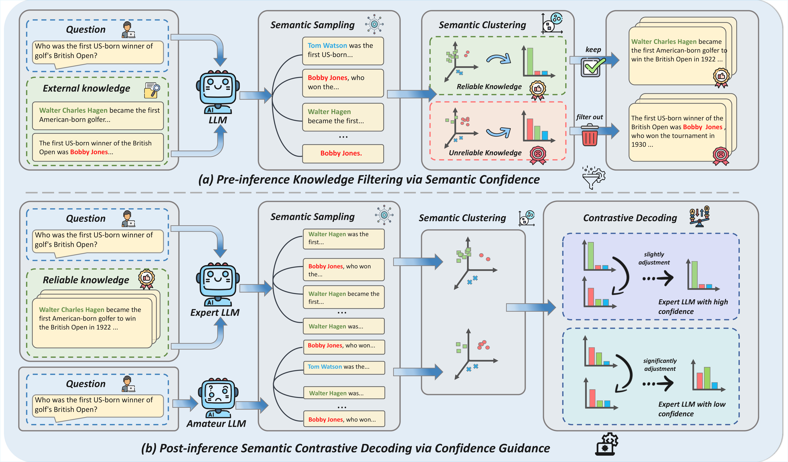

# DS-CMS²: Dual-Stage Confidence Measurement in Semantic Space

Official implementation of **DS-CMS²**, a training-free framework for mitigating knowledge conflicts in retrieval-augmented generation (RAG).

## Method Overview

> **[Mitigating Knowledge Conflicts of Retrieval-Augmented Generation through Dual-Stage Confidence Measurement in Semantic Space](./Mitigating_Knowledge_Conflicts_of_Retrieval-Augmented_Generation_through_Dual-Stage_Confidence_Measurement_in_Semantic_Space.pdf)**  
> Jia Zhang, Zhiheng Zhang, Zeao Ji, Tengfei Ma, and Daojian Zeng. COLM 2026.

## Overview

RAG can be harmed by two distinct forms of conflict:

- **Inter-context conflict:** retrieved documents disagree with one another or contain irrelevant/misleading evidence.
- **Context-memory conflict:** retrieved evidence disagrees with the language model's parametric knowledge.

DS-CMS² addresses both without additional training by measuring confidence in **semantic space** at two stages:

1. **Pre-inference knowledge filtering.** For each evidence document, the model samples multiple answers, clusters semantically equivalent answers, and computes semantic entropy. Documents whose entropy exceeds a threshold are filtered out; if none remain, the method falls back to closed-book generation.
2. **Post-inference semantic contrastive decoding (SCD).** The model generates answer distributions in professional (context-aware) and amateur (question-only) modes, jointly clusters their raw samples, and uses the expert semantic entropy as a dynamic contrast strength. This emphasizes answers supported by reliable context while avoiding fixed-strength overcorrection.

## Installation

~~~bash
git clone https://github.com/hnnuzhangjia/CMS-2.git
cd CMS-2
pip install -r requirements.txt
~~~

Requirements: Python 3.8+ and an OpenAI-compatible API endpoint for semantic entailment judgments (GPT-4o-mini by default).

## Configuration

| Parameter | Default | Description |
| --- | --- | --- |
| `num_samples` | `10` | Samples per evidence document and per decoding mode |
| `entropy_threshold` | `1.0` | Maximum evidence entropy, measured in bits |
| `professional_temperature` | `0.9` | Expert sampling temperature |
| `amateur_temperature` | `0.9` | Amateur sampling temperature |
| `nli_model` | `gpt-4o-mini` | Semantic entailment model |

Add `code/` to your Python import path and import `SCD` or `scd_decode` from `dscms2`. Provide a generation backend through `llm_func(prompt, temperature)`.

`SCD.decode()` samples answers and performs both stages. `scd_decode()` accepts answer-frequency dictionaries for semantic contrastive decoding.

## Citation

~~~bibtex
@inproceedings{zhang2026dscms2,
  title={Mitigating Knowledge Conflicts of Retrieval-Augmented Generation through Dual-Stage Confidence Measurement in Semantic Space},
  author={Zhang, Jia and Zhang, Zhiheng and Ji, Zeao and Ma, Tengfei and Zeng, Daojian},
  booktitle={Conference on Language Modeling (COLM)},
  year={2026}
}
~~~

## License

No license file is currently included. Please contact the authors before using this code beyond the repository's intended research purposes.

